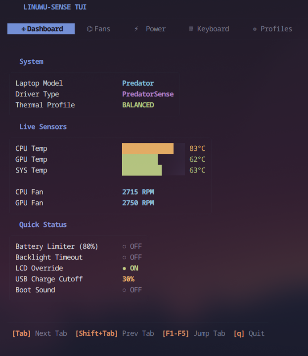
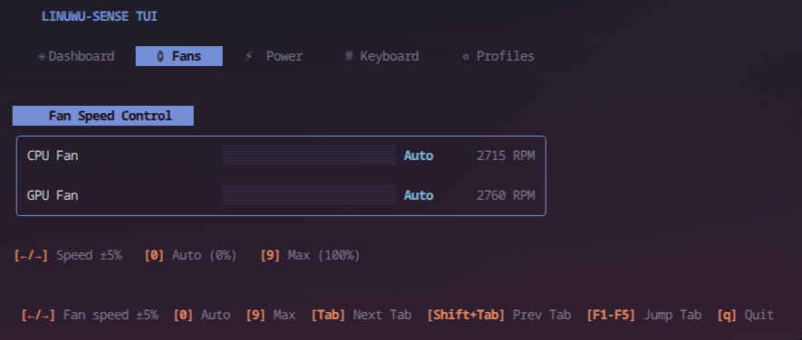
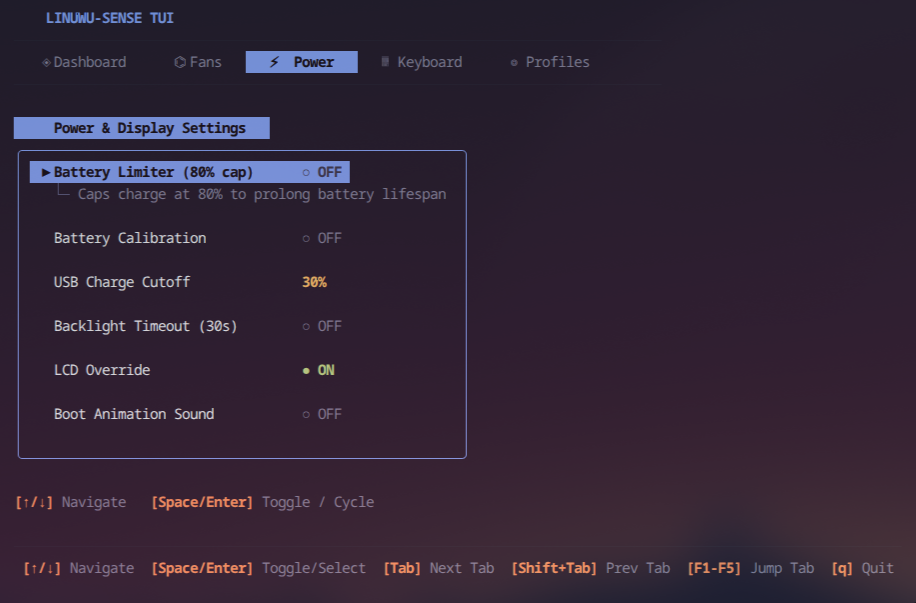
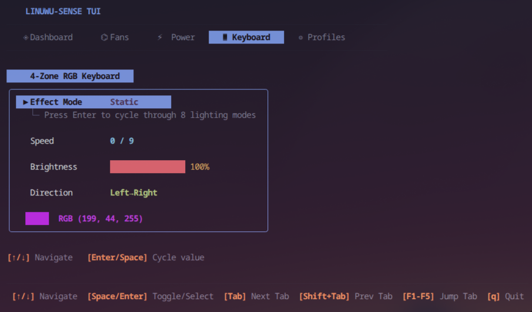
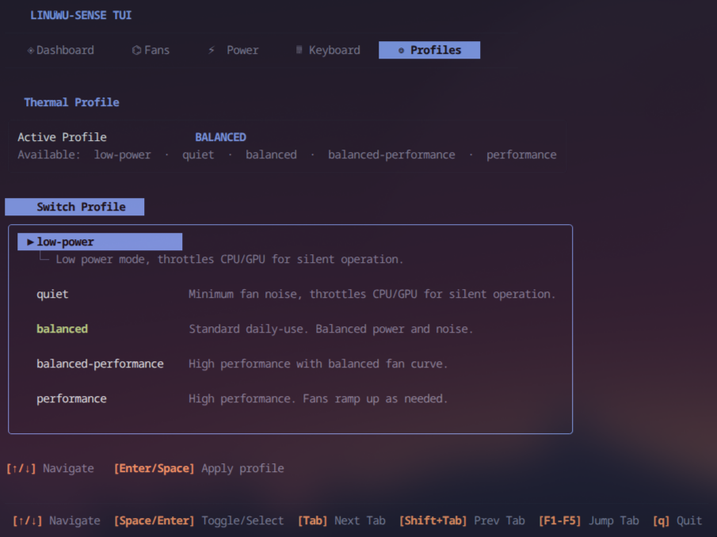

# 🐾 linuwu-sense-tui

A modern, fast, and standalone Terminal UI (TUI) and control utility for Acer Predator & Nitro laptops using the [Linuwu-Sense](https://github.com/0x7375646F/Linuwu-Sense) Linux kernel module.

Built in **Go** using [Bubble Tea](https://github.com/charmbracelet/bubbletea), [Lip Gloss](https://github.com/charmbracelet/lipgloss), and [Cobra](https://github.com/spf13/cobra).

---

## 📸 Screenshots

### ◈ Dashboard


### ⌬ Fans


### ⚡ Power & Display


### ⌨ Keyboard


### ◎ Profiles


---

## ⚡ Features

- **Live Thermal & Fan Monitoring** — Real-time CPU, GPU, and System temperatures with bar graphs and live fan RPM tachometer.
- **Fan Speed Control** — Set custom speeds or use Auto/Max presets. Uses `←/→` keys for fine ±5% adjustment.
- **Thermal Profiles** — Switch between all ACPI platform profiles supported by your system (e.g. `quiet`, `balanced`, `performance`, `turbo`).
- **Power & Display Settings** — Toggle battery limiter (80% cap), battery calibration, USB charge cutoff, backlight timeout, LCD override, and boot animation sound.
- **4-Zone RGB Keyboard** — Full control over lighting effect mode, animation speed, brightness, and direction.
- **Mouse Support** — Click tabs and options directly with your mouse.
- **Embedded Kernel Driver** — Driver source is embedded via `//go:embed`. Install both driver and TUI with `go install` + `linuwu-sense-tui setup`.

---

## 🚀 Quick Start

### 1. Install via Go

```bash
go install github.com/Himesh-Kundal/linuwu-sense-tui@latest
```

### 2. Load the Driver

If you haven't installed the `linuwu_sense` kernel module yet, run the embedded setup:

```bash
linuwu-sense-tui setup
```

This extracts the embedded C driver source and runs `sudo make install`.

### 3. Launch the TUI

```bash
# Run with sudo for full write access to sysfs controls
sudo linuwu-sense-tui

# Or grant your user write access to the sysfs paths instead
linuwu-sense-tui
```

---

## ⌨ Keybindings

| Key | Action |
|-----|--------|
| `Tab` / `Shift+Tab` | Cycle through tabs |
| `F1` – `F5` | Jump directly to a tab |
| `↑` / `↓` (or `k` / `j`) | Move cursor within a tab |
| `Space` / `Enter` | Toggle / apply selected item |
| `←` / `→` (Fans tab) | Adjust fan speed ±5% |
| `0` (Fans tab) | Set Auto mode (0%) |
| `9` (Fans tab) | Set Max speed (100%) |
| `q` / `Ctrl+C` | Quit |

---

## 💻 CLI Commands

`linuwu-sense-tui` also supports headless use:

```bash
# One-shot hardware status dump
linuwu-sense-tui status

# Extract and build the embedded kernel module
linuwu-sense-tui setup
```

---

## 🙏 Credits & Acknowledgements

- **Kernel Module (`linuwu_sense`)**: Developed by **[0x7375646F](https://github.com/0x7375646F)** in the **[Linuwu-Sense](https://github.com/0x7375646F/Linuwu-Sense)** project (reverse engineered from Acer PredatorSense). Licensed under GPL-3.0.
- **Acer WMI Driver Basis**: Originally by Carlos Corbacho, E.M. Smith, and the Linux kernel platform driver team.
- **TUI & CLI**: Created by [Himesh Kundal](https://github.com/Himesh-Kundal) using [Charm](https://charm.sh) (Bubble Tea & Lip Gloss).

---

## 📄 License

GNU General Public License v3.0 (GPL-3.0) — matches the upstream [Linuwu-Sense](https://github.com/0x7375646F/Linuwu-Sense) license.
